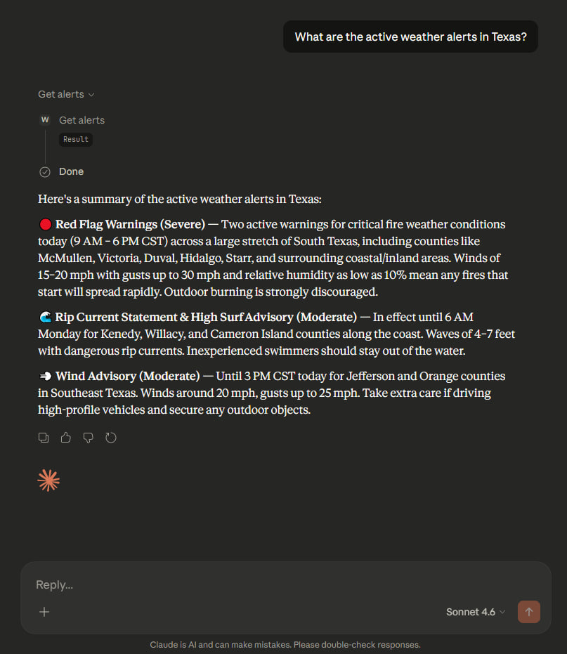
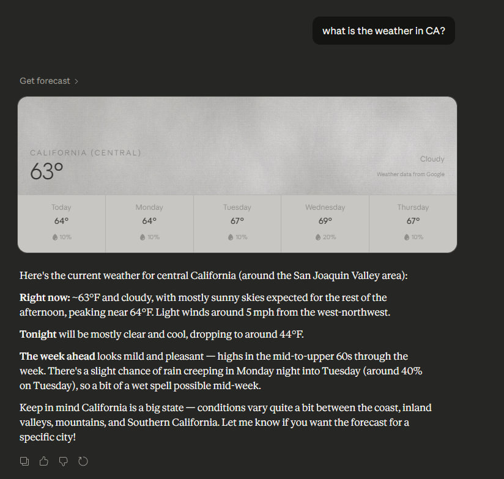
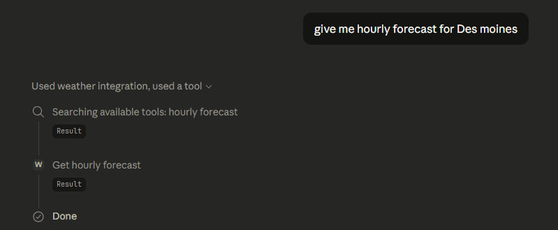
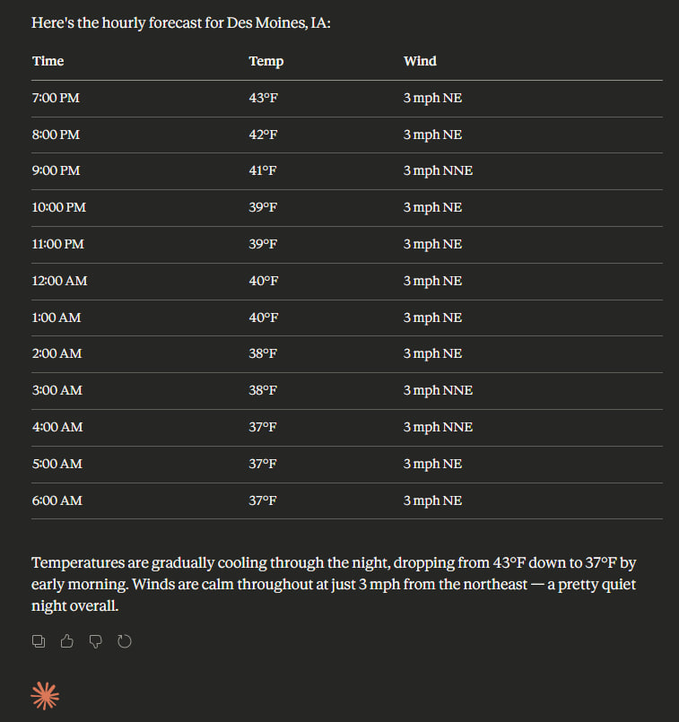

# Weather MCP Server

A Model Context Protocol (MCP) server that provides real-time US weather alerts and forecasts by integrating with the National Weather Service API. It connects directly to Claude Desktop, enabling Claude to fetch live weather data through natural language requests.

## Demo






## Tools

- `get_alerts` — Get active weather alerts for a US state (e.g. `TX`, `CA`)
- `get_forecast` — Get weather forecast for a location by latitude and longitude
- `get_hourly_forecast` — Get hour-by-hour forecast for the next 12 hours by latitude and longitude

## Setup

1. Install [uv](https://docs.astral.sh/uv/)
2. Clone the repo and run `uv sync`
3. Add to your `claude_desktop_config.json`:

```json
{
  "mcpServers": {
    "weather": {
      "command": "uv",
      "args": ["--directory", "/path/to/weather", "run", "weather.py"]
    }
  }
}
```
